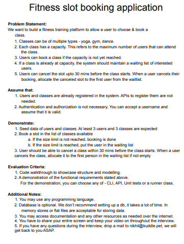
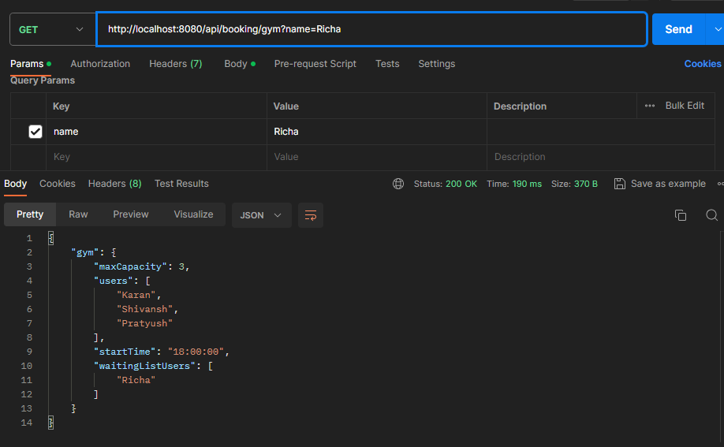
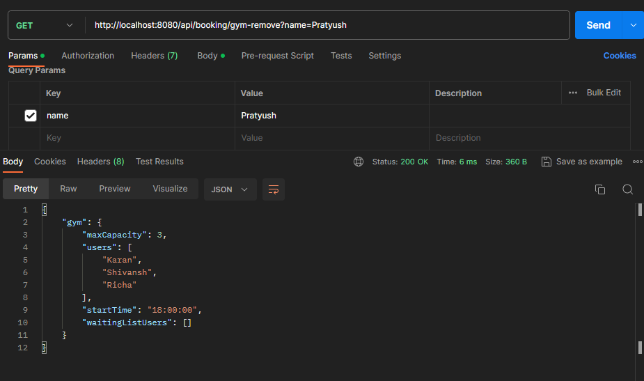

## PROBLEM STATEMENT ##


## TO DO ##
1.Implementing same logic for Dance and Yoga Classes
2.Design the database schema and database connectivity for persistance
3.Cleaner error handling


## FLOW FOR DEMO PURPOSES ##



## DTO ## 
```
{
    "gym": {
        "maxCapacity": 3,
        "users": [
            "Karan",
            "Shivansh",
            "Pratyush"
        ],
        "startTime": "18:00:00",
        "waitingListUsers": [
            "Richa"
        ]
    }
}
```

```
{
    "gym": {
        "maxCapacity": 3,
        "users": [
            "Karan",
            "Shivansh",
            "Richa"
        ],
        "startTime": "18:00:00",
        "waitingListUsers": []
    }
}
```
